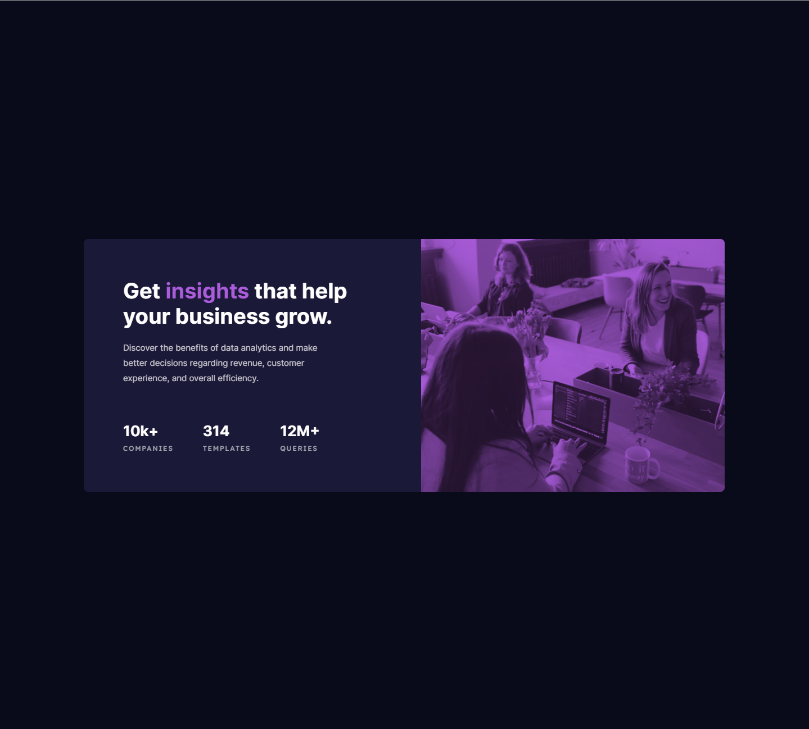

# Frontend Mentor - Stats preview card component solution

This is a solution to the [Stats preview card component challenge on Frontend Mentor](https://www.frontendmentor.io/challenges/stats-preview-card-component-8JqbgoU62). Frontend Mentor challenges help you improve your coding skills by building realistic projects.

## Table of contents

- [Overview](#overview)
  - [The challenge](#the-challenge)
  - [Screenshot](#screenshot)
  - [Links](#links)
- [My process](#my-process)
  - [Built with](#built-with)
  - [What I learned](#what-i-learned)
- [Author](#author)

## Overview

### The challenge

Users should be able to:

- View the optimal layout depending on their device's screen size

### Screenshot



### Links

- Solution URL: (https://www.frontendmentor.io/solutions/responsive-site-with-css-vars-x9QFb1XaX)
- Live Site URL: (https://lm-stats-preview-card.netlify.app/)

## My process

### Built with

- Semantic HTML5 markup
- CSS custom properties/vars
- Flexbox
- Desktop-first workflow

### What I learned

This was a pretty easy challenge for me, as I'm starting from the easy projects on frontend mentor and working my way through them all, however I still learnt something! Firstly, most of my time was spent trying to be pixel perfect, and I didn't have design files so kept readjusting stuff (me trying to be perfect...)

One thing I learnt was the mix-blend-mode property for images, to try to get my image overlay to match the design image.

```css
.card-img {
  object-fit: cover;
  mix-blend-mode: multiply;
  opacity: 80%;
}
```

Along with this property, I lowered opacity and it made the image fit in with the whole colour theme so much better.

## Author

- Website - [Leon Michalak](https://www.leonmichalak.tech)
- Frontend Mentor - [@NinjaInShade](https://www.frontendmentor.io/profile/NinjaInShade)
- Instagram - [@lmdeveloper](https://www.instagram.com/lmdeveloper/)
